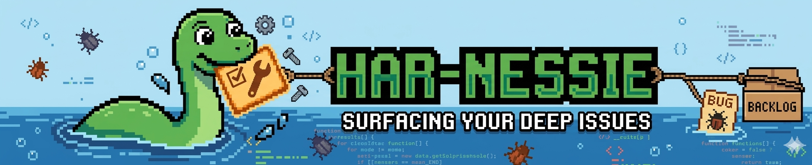
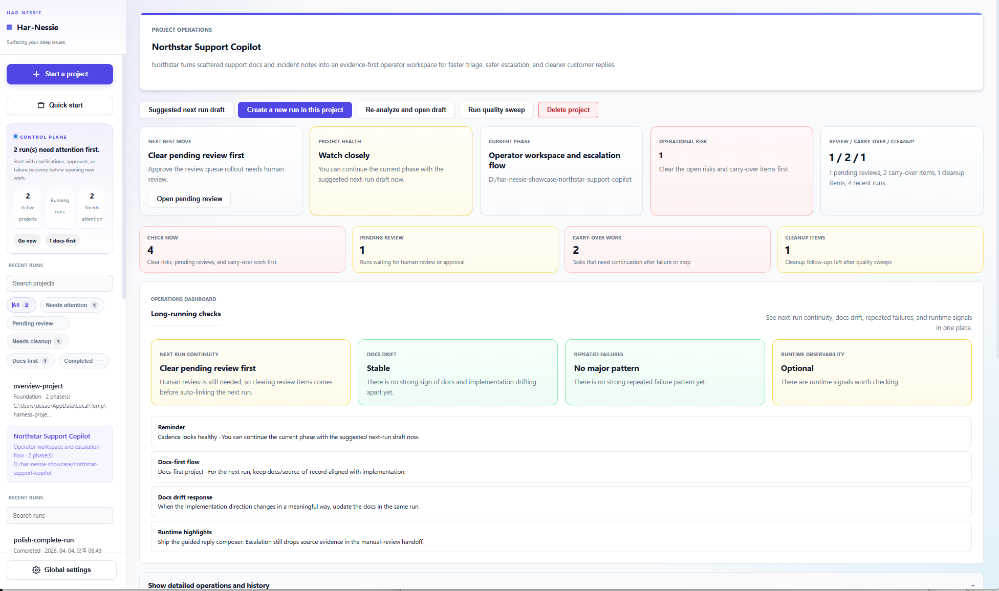
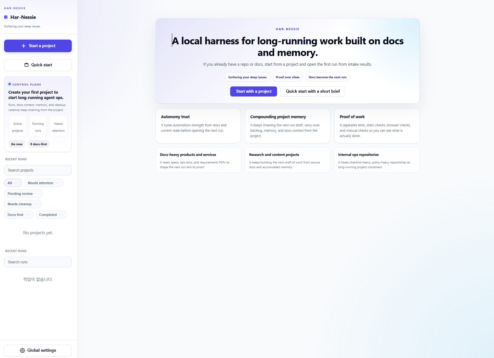
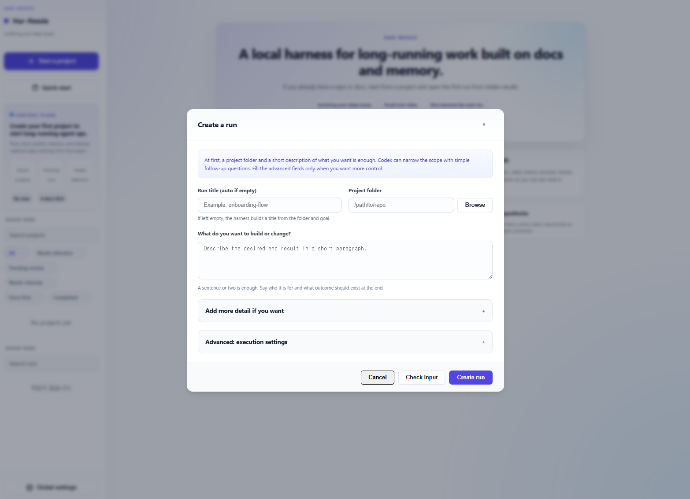

<p align="center">
  
</p>

# Har-Nessie

English · [한국어](./README.kr.md)

**Your AI forgets your project after every session. Har-Nessie doesn't.**

You've done this. Session 1: spend an hour getting the AI up to speed. Session 2: explain it all again. Session 3: same. Every run starts from scratch. A failed attempt leaves no trace. Good work evaporates.

That's not a model problem. That's a harness problem.

Give Har-Nessie a folder — code, notes, plans, PDFs, whatever you have — and tell it what you want done. It reads everything, makes a plan, does the work, and *remembers what happened*. Next session picks up where the last one left off.

```
docs → run → memory → next run
```

Works with **Codex CLI**, **Claude Code**, and **Gemini CLI**.  
Runs entirely on your machine. No cloud account. No npm install.  
**You don't need to be a developer.** Give it your notes folder. It figures out the rest.

---

## There's a reason it's called a harness

Anthropic published [research on this](https://www.anthropic.com/engineering/effective-harnesses-for-long-running-agents) and called it *harness engineering* — the loop around the model matters as much as the model itself. Same AI, better harness = completely different results.

Most tools give you the model. Har-Nessie is the harness.

The difference in practice:

- **Before a run** — preflight scores *how safe the handoff actually is*. Not just "ready." A real number.
- **During a run** — it reads your actual docs and repo, not just your prompt. Grounded context, not hallucinated assumptions.
- **After a run** — verification evidence you can inspect: `TEST / STATIC / BROWSER / MANUAL`. Proof, not vibes.
- **When something fails** — surfaces why, what it tried, and what to do next. No more staring at a broken session.
- **Next time** — session 5 knows what sessions 1–4 found. The harness accumulates. The model doesn't have to.

<p align="center">
  
  <br><em>Project board — next run already drafted, health signals, continuity in one place</em>
</p>

---

## Quick start

```sh
# macOS / Linux
./harness.sh

# Windows
harness.cmd
```

Open the local URL. If you have a repo or docs folder: **New Project → Project Analysis**.

<p align="center">
  
  <br><em>Point it at a folder. It figures out the rest.</em>
</p>

## Requirements

- Node.js 22+
- At least one agent CLI installed and authenticated (see below)
- No npm install. No cloud account for the harness itself.

## CLI support

All three major agent CLIs work. Pick whichever you have:

| CLI | How to get it |
|-----|---------------|
| [Codex CLI](https://github.com/openai/codex) | `npm i -g @openai/codex` — ChatGPT Plus or Pro |
| [Claude Code](https://github.com/anthropics/claude-code) | `npm i -g @anthropic-ai/claude-code` — Anthropic subscription |
| [Gemini CLI](https://github.com/google-gemini/gemini-cli) | `npm i -g @google/gemini-cli` — Google account |

You can mix: one CLI for planning, another for implementation, in the same run.

Global settings also let you keep Codex on `GPT-5.4` by default, switch to `GPT-5.3-Codex-Spark` when you want a faster worker, and toggle Codex fast mode on or off without editing config files by hand.

<p align="center">
  
  <br><em>Folder + goal. The harness handles the rest.</em>
</p>

## This is for you if

- Your AI keeps starting from scratch every session and it's costing you hours
- You have a folder with notes, specs, or research — **code is optional**
- The work takes more than one sitting
- You've been burned by "the model said it's done" when it wasn't
- You want to see *what actually happened*, not just whether the AI seemed confident

**Researchers** use it on paper and notes folders. **PMs** use it on PRDs and meeting notes. **Writers** use it on draft and research folders. **Developers** use it when a project runs longer than one session. The common thread: work that needs to continue.

## How it fits with existing tools

Har-Nessie is not an agent framework (not LangChain, not LlamaIndex, not CrewAI). It's not an IDE plugin (not Cursor, not Windsurf). It's the harness layer that wraps whatever CLI you already use — Codex, Claude Code, or Gemini CLI — and adds the memory, preflight, verification, and recovery that those CLIs don't provide on their own.

If you've tried AI coding tools and kept running into the same wall — context lost, work repeated, "done" that wasn't — that's the harness gap. This fills it.

## Storage (all local)

```
runs/<run-id>/
projects/<project-id>/
memory/projects/<project-key>/
.harness-web/settings.json
```

All machine-local. Gitignored by default.

That local settings file stores your selected Codex model and Codex fast mode toggle too.

## Docs

- [User Guide](./USER_GUIDE.md)
- [Architecture](./ARCHITECTURE.md)
- [Operations](./OPERATIONS.md)
- [Deployment](./DEPLOYMENT.md)

## Development check

```sh
npm run validate
```
